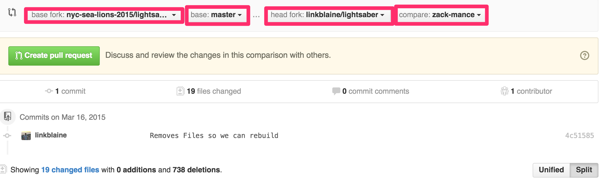

# Lightsaber

## Daily Release: Day 1 Basic Sinatra

Today's challenge is as follows:

- Add a Gemfile, set the source to ruby gems, and require the sinatra gem.
- Add an index controller
- Add a get route to the root directory.
- In that route render a response with the message. "Hello Phase 2 Teachers"

## Submitting your challenge

Commit all of your code to the day-1 branch on your respository. Then submit a pull request to the nyc-sea-lions-2015 master branch. In the pull request comment @ your Phase 2 instructor, and your Cohort lead.

